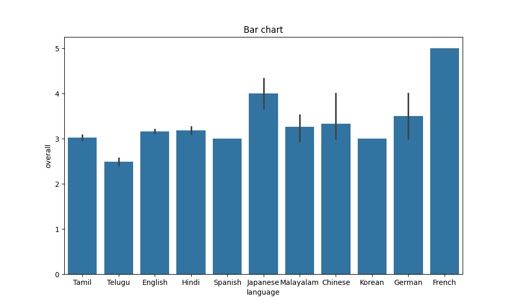

# Description of the file

MEDIA.CSV is used as input for the analysis. This file contains 2652 rows and 8 columns.
The file contains data related to some evaluation or ratings system, likely gathering user or expert reviews on various items identified by title.
Data in the file can contain ['categorical', 'numerical', 'time-series']

### Statistical Details:

## Summary Statistics

|       |    overall |     quality |   repeatability |
|:------|-----------:|------------:|----------------:|
| count | 2652       | 2652        |     2652        |
| mean  |    3.04751 |    3.20928  |        1.49472  |
| std   |    0.76218 |    0.796743 |        0.598289 |
| min   |    1       |    1        |        1        |
| 25%   |    3       |    3        |        1        |
| 50%   |    3       |    3        |        1        |
| 75%   |    3       |    4        |        2        |
| max   |    5       |    5        |        3        |

## Missing Values

- date: 99 missing values
- by: 262 missing values
## Graphical Representation of data

